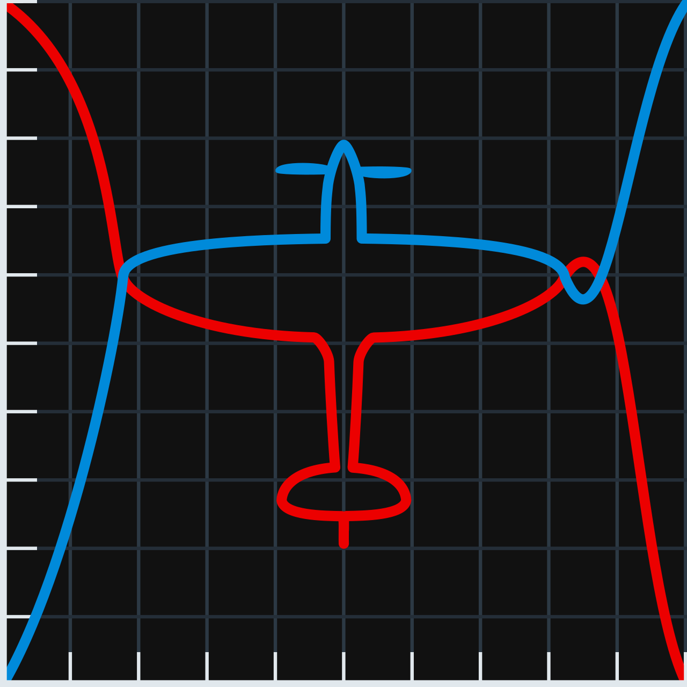

<h1>War Thunder Aircraft Performance Calculator.org</h1>

## [**wtapc.org**](https://www.wtapc.org) - Website for generating graphs of engine power and power/weight of all piston aircraft and thrust of all jets in War Thunder, at all altitudes.

v.2.2.1

<h3>Current features:</h3>
<ol>
<li>Piston Engine Power</li>
<li>Power/Weight</li>
<li>Jet and Rocket engine thrust</li>
<li>Thrust/Weight</li>
<li>Interactive 2D graphs</li>
<li>Airplane select with icons</li>
</ol>

### Known issues - contribution appreciated:

1. P-63 A-10, A-5 and C5 engine power graphs don't match ingame engine power very well. These 3 are calculated in a unique way; engine power above critical altitude doesn't drop proportionally to air pressure drop (concave), but in a convex way, and that's difficult to model. (look for `ConstRPM_bends_above_crit_alt` function in `plane_power_calculator`, it's made to distinguish them).

2. Tu-1 power is almost precise but also not exact.

3. Planes with constant pitch propeller have differnt RPMs at different speeds, and these scripts don't account for that. As a result, at low speeds those planes have more power on the graphs than in game. To resolve that propeller torque needs to be calculated and prop governor simulated.

4. Jet thrust can be incorrect.

<h3>For more information visit:</h3>

the dataset used as input for this website [**the GitHub repository of the calculations**][1] and [**Discord of WTAPC**][2]

<h1 align="left"></h1>

### Thanks:

* [gszabi99][3] and Oshida - Providing a reliable up to date [datamine][4] of WT flight-model files, essential for the project to even exist. 

* [\_avb\_][5] - Making [WTRTI][6], a tool necessary to make ingame engine power/altitude graphs. I used them as a comparison to calculated engine power during development. Without WTRTI, the project would take many more years to get to this stage.

* [Xelph][7] - Helping to set up repo and GitHub Pages of wtapc.org. Advice on website-making and propeller efficiency.

* [dogeness][8] Explaining how aero piston engines works IRL and in WT (a good read [here][9]), which helped figure out how to calculate engine power. Advice on graphs layout.

* [AdamTheEnginerd][10] - A very big inspiration to start visualizing aircraft performance.

[1]: https://github.com/Alpakinator/wt-aircraft-performance-calculator
[2]: https://discord.gg/6F7ZRk3zJG
[3]: https://github.com/gszabi99
[4]: https://github.com/gszabi99/War-Thunder-Datamine
[5]: https://github.com/MeSoftHorny
[6]: https://mesofthorny.github.io/WTRTI/
[7]: https://github.com/LFS6502
[8]: https://www.youtube.com/@dogeness/videos
[9]: https://docs.google.com/document/d/1fp7rpu-Bqh7uFjMg7sCQlMZgf6pIoJ_qfRzihc6iIB4/edit
[10]: https://www.youtube.com/@AdamTheEnginerd
